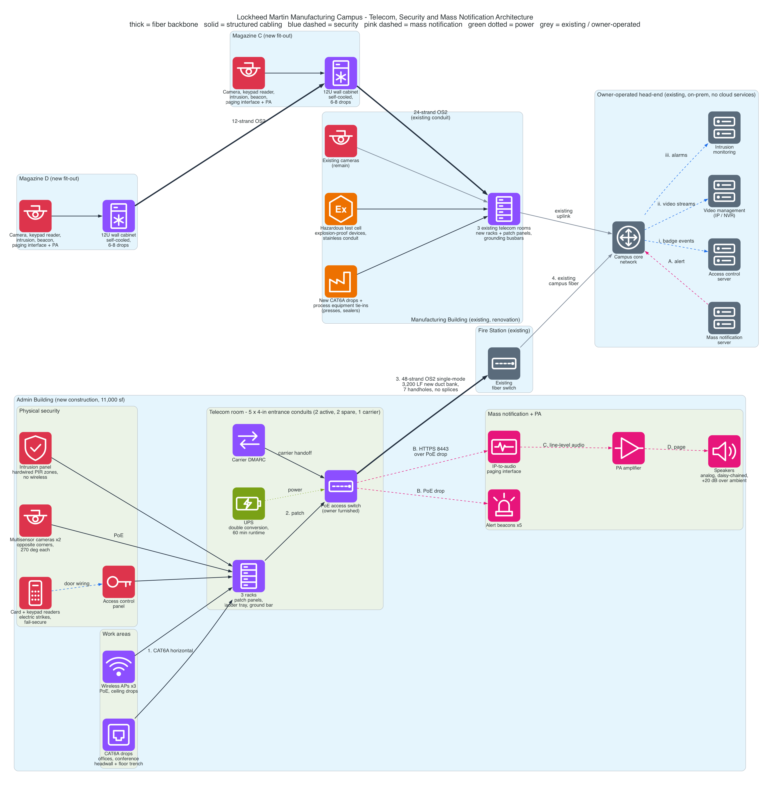

# Campus Telecom, Security and Mass Notification Architecture

Design of the low-voltage infrastructure for a facility upgrade at a Lockheed Martin manufacturing campus: a new 11,000 sf administration building, the renovation of an existing manufacturing building, and the fit-out of two above-ground magazines.

I was the electrical engineer responsible for the telecom, security and public address / mass notification design. Site, building and room identifiers and product names are intentionally left out.



## What I designed

| Area | Scope |
|---|---|
| Campus backbone | Single-mode fiber and underground pathway linking the new and fitted-out buildings to the existing campus network |
| Building telecom | Telecom rooms, racks, pathways, structured cabling, wireless drops and grounding in four buildings |
| Physical security | Video surveillance, access control and intrusion detection |
| Mass notification | Alert beacons and a network-to-audio bridge into each building's public address system |
| Specifications | The communications and electronic security specification sections that govern the installation |

## Campus backbone

**Administration building to the existing fire station**

- 48-strand OS2 single-mode fiber, terminated on the existing fiber switch with LC connectors and 10 ft of slack.
- About 3,200 linear feet of new 4-inch concrete-encased duct bank.
- Seven handholes at no more than 600 ft spacing.
- Pulled through end to end with no splices, so there are no splice losses or splice enclosures to maintain.

**Magazines to the manufacturing building**

- 12-strand OS2 from the far magazine to the near magazine.
- 24-strand OS2 from the near magazine to an existing telecom room in the manufacturing building.
- Reuses an existing 2-inch conduit, with a new conduit entry at an existing pull box so the fiber is pulled through rather than spliced.

**Building entrance**

- Five 4-inch conduits into the administration building telecom room: two active, two spare, and one reserved for a service provider and extended to the nearest handhole.

## Building telecom

**Administration building (new construction)**

- Telecom room sized for three racks plus the service provider demarcation, with dedicated power circuits for the racks and the demarcation equipment.
- CAT6A horizontal cabling throughout.
- Conference room: a data drop at the display headwall and a floor trench carrying the pathway from the headwall to the table.
- Three ceiling drops for wireless access points (two in the office area, one at the far end of the warehouse), served by an owner-furnished PoE switch.

**Manufacturing building (existing, renovation)**

- New CAT6A drops across the production rooms, including drops beside curing ovens.
- Eight drops relocated from columns to overhead beams on strut at 10 ft above the floor, to clear the production floor.
- Data tie-ins for owner-supplied process equipment such as press stands and sealers.
- An operator station with a network drop and an HDMI-over-category-cable run to a display.
- New racks and patch panels in the three existing telecom rooms.
- Telecom grounding: a primary bonding busbar and two secondary bonding busbars across the three rooms.
- Hazardous test cell: every device upgraded to explosion-proof and the conduit changed to stainless steel.

**Magazines (two buildings)**

- Six to eight data drops and a ground bar in each.
- A wall-mounted telecom rack in each electrical room. The room has no dedicated telecom cooling and a room-level split system would have forced a panel upsize, so I proposed a 12U cabinet with its own internal cooling instead.

**Common infrastructure**

- Racks and patch panels from a single manufacturer for all categories.
- Cable tray: metal ladder and solid-bottom, hot-dip galvanized.
- Conduit: galvanized EMT indoors, galvanized rigid steel for underground elbows, rigid PVC in the duct bank, stainless in the hazardous area.
- Rack power: double-conversion online UPS with 60 minutes of runtime, feeding rack-mounted power distribution units.

## Physical security

**Video surveillance**

- Administration building: two exterior multisensor cameras at opposite corners, each covering 270 degrees, so two devices watch all four sides.
- Magazines: one exterior camera per building.
- Manufacturing building: the existing cameras remain.
- IP cameras recorded to network video recorders.

**Access control**

- Card readers with keypads at building entries, including the front door of each magazine.
- Card-only readers at utility rooms and the warehouse.
- Electric strikes that fail secure, so a door stays locked on loss of power.
- On-premises system with no cloud services.

**Intrusion detection**

- A panel in the administration building and in each magazine.
- Hardwired passive infrared zones only, no wireless zones.
- Kept separate from the fire alarm system.

## Mass notification and public address

- Each building has a centralized analog public address system, daisy-chained, designed for 20 dB above ambient noise.
- Alert beacons: five in the administration building (entrance, breakroom, open office and both ends of the storage area) and one in each magazine.
- Each building with its own public address system gets an IP-to-audio paging interface. It sits on the network, receives alerts from the campus mass notification server over HTTPS, and feeds line-level audio into the amplifier input.
- The interface is powered over Ethernet, so it needs only a data drop at the public address rack.

The result is that one campus-wide alert reaches both the visual beacons and the speakers in every building without replacing the analog audio systems.

## Specifications

I wrote the specification sections covering:

- Hangers and supports, conduits and cable trays for communications
- Structured cabling and communications equipment room fittings
- Public address and voice communications
- Access control, video surveillance and intrusion detection

## Regenerating the diagram

The diagram is generated from code with Graphviz and the Python `diagrams` package.

```bash
brew install graphviz librsvg
```

```bash
python3 -m venv .venv && .venv/bin/pip install diagrams
```

```bash
.venv/bin/python architecture.py
```
